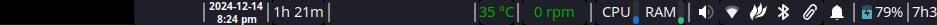

# My XFCE Panel Configuration

## Overview

This repository contains my personal XFCE panel configuration, carefully customized for optimal productivity and aesthetic appeal.

## Screenshots

Here are some screenshots of my XFCE panel configuration:


---

---


## Prerequisites

- XFCE Desktop Environment
- `xfce4-panel-profiles` utility

## Installation

1. Clone the repository:
   ```bash
   git clone git@github.com:7h3Y055/My-xfce-panel.git
   cd My-xfce-panel
   ```

2. Load the configuration:
   ```bash
   xfce4-panel-profiles load 7h3.tar.bz2
   ```

### Saving Your Own Configuration
If you want to save your current panel setup:
```bash
xfce4-panel-profiles save my-config.tar.bz2
```

## Manual Plugin Configuration

### Sensors Plugin

To manually configure the sensors plugin:

1. Open the panel preferences:
    ```bash
    xfce4-panel --preferences
    ```

2. Configure the sensors plugin:
    - Right-click on the sensors plugin in your panel and select `Properties`.
    - Customize the sensors to display according to your preferences.

### Additional Plugins

For other plugins, follow similar steps:
1. Open the panel preferences.
2. Add the desired plugin.
3. Right-click on the plugin and configure its properties.

## Troubleshooting

- Ensure `xfce4-panel-profiles` is installed
- Restart XFCE if configuration doesn't apply correctly

